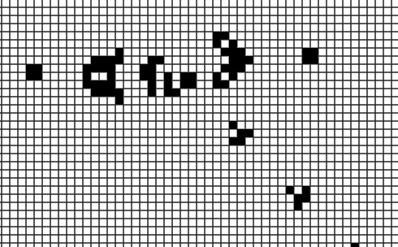
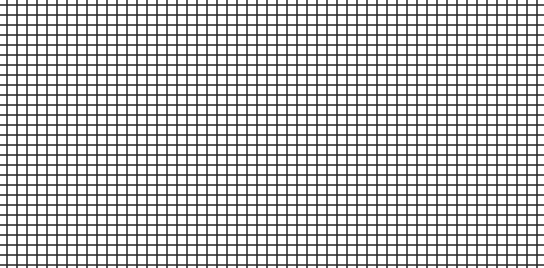

# The Sims v0

Sims0 is a JavaScript implementation of Conway's Game of Life.

[Live!](https://vorpus.github.io/theSims0/)

## Background

Conway's Game of Life is a cellular atomaton simulation where Cells live (represented by a black square) or die (white square) based on a set of four simple conditions...
1. A live cell < 2 live neighbours dies (underpopulation)
2. A live cell with 2-3 live neighbors continues living
3. A live cell with > 3 live neighbors dies (overpopulation)
4. A dead cell with exactly 3 live neighbors comes to life (reproduction)



Each frame of the game represents a generation, and a cell's life and death outcome is calculated on the end of that frame. From this simple logic, players have found many interesting patterns in game of life.

## How it works

### Generations
After each frame, the game needs to evaluate which cells should live and which cells should die. Because a cell directly affects its neighbors, we can't toggle them as we iterate through the 'world', so we queue actions to be performed at the end.

```javascript
step() {
  let cellsToLive = [];
  let cellsToDie = [];

  for (let i = 0; i < this.x; i++) {
    for (let j = 0; j < this.y; j++) {
      let neighborCount = this.neighbors(i,j);
      let fate = this.myFate(i, j, neighborCount);

      if (fate === 'live') {
        cellsToLive.push([i,j]);
      } else if (fate === 'die') {
        cellsToDie.push([i,j]);
      }
    }
  }
  this.createLife(cellsToLive);
  this.reaperLife(cellsToDie);
}
```

### Templates
There are dozens of well-established Life communities on the internet who have found patterns that generate interesting behavior in Game of Life. Patterns are implemented as 2D arrays containing 0's for dead cells and 1's for alive cells. This allows easy insertion into the game by iterating over the pattern and fast addition of new patterns using community websites.

```javascript
static pentadecathlon () {
  return [
    [0,0,1,0,0,0,0,1,0,0],
    [1,1,0,1,1,1,1,0,1,1],
    [0,0,1,0,0,0,0,1,0,0]
  ]
}
```


### Blueprints
To implement blueprints depicting the breadth of an area a pattern the user is attempting to place will affect without using a library, I implemented a listener that renders the entire board with the blueprint placed correctly on each mouse move.



```javascript
hoverHandler(x, y, ctx) {
  let cellXpos = Math.floor(x/Canvas.CELLXDIM)*Canvas.CELLXDIM;
  let cellYpos = Math.floor(y/Canvas.CELLYDIM)*Canvas.CELLYDIM;

  let templateHeight = this.template.length*Canvas.CELLXDIM;
  let templateWidth = this.template[0].length*Canvas.CELLYDIM;

  this.draw(ctx);
  ctx.fillStyle = 'rgba(255,255,0,0.3)';
  ctx.fillRect(cellXpos, cellYpos, templateWidth, templateHeight);
}
```

## Tech

* **jQuery** - takes care of the user interface and interactions

* **HTML5 Canvas** - used to draw the 'world'. Canvas' strong performance is notable in this implementation of 'Game of Life' since the the entire grid is redrawn cell-by-cell every frame.
